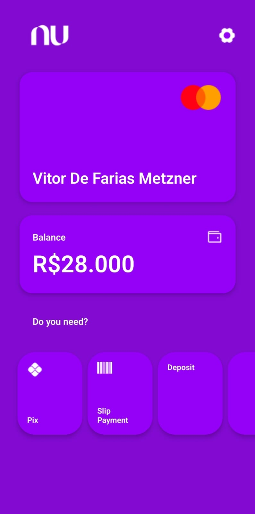

<h1 align="center">
    Interface Nubank Clone
</h1>

<h4 align="center">
  ☕ Code and coffee
</h4>

  <a href="#rocket-tecnologias">Technologies</a>&nbsp;&nbsp;&nbsp;|&nbsp;&nbsp;&nbsp;
  <a href="#-projeto">Project</a>&nbsp;&nbsp;&nbsp;|&nbsp;&nbsp;&nbsp;

 

  

## :rocket: Technologies

This project was developed with the following technologies:

- [React Native](https://facebook.github.io/react-native/)

## 💻 Project

A clone of the Nubank bank interface with React Native.

